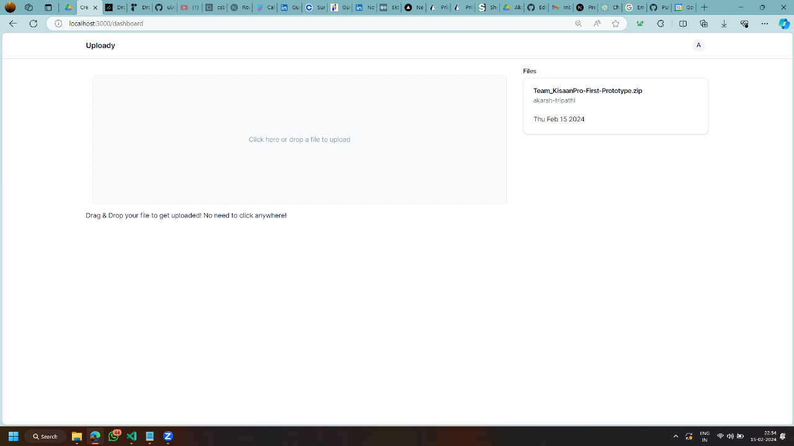
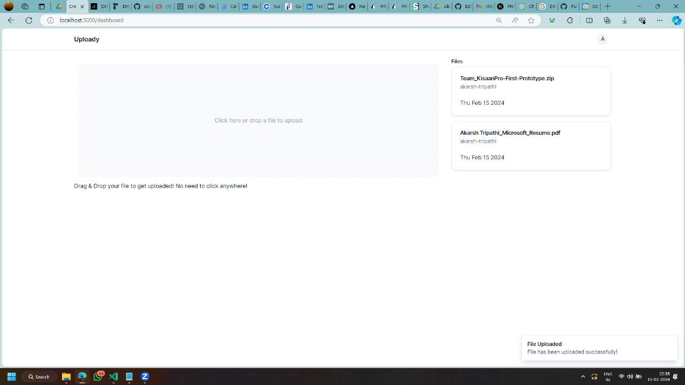
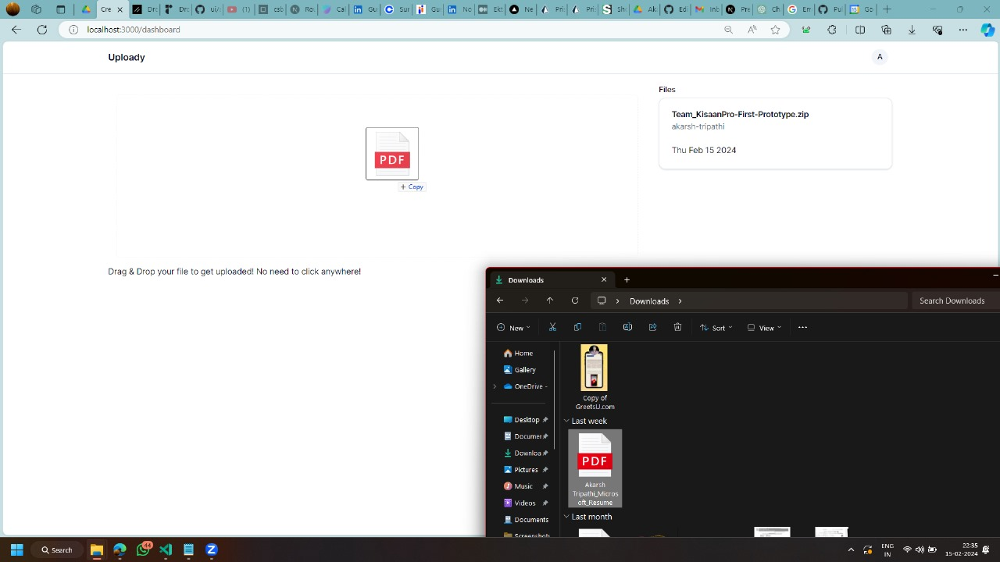
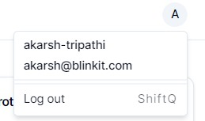

 

  <h3 align="center">Uploady (Blinkit)</h3>
<!--  -->

  

    A NextJS app to Upload your Files & Share with others. 
     
  

  

## Table Of Contents

* [About the Project](#about-the-project)
* [Built With](#built-with)

## About The Project

The Project has been created to implement an Authentication System using JWT with the use of the Postgres Database. I've used Prisma ORM to manage the querying & migrates of the database.
Uploady support files that can be shared with others using Supabase Storage as Bucket similar to Amazon S3 Buckets. 

## Running locally in development mode

To get started, just clone the repository and run `npm install && npm run dev`:

    git clone https://github.com/akarsh-tripathi/upload_nextjs
    npm install
    npx prisma generate && npm run dev

## Built With

The Software was built on top of 
* NEXTJS Framework (Server Side rendering)
* Used Supabase for Postgres Database
* Used NextAuth + Prisma (ORM) 
* Postman for API Testing

